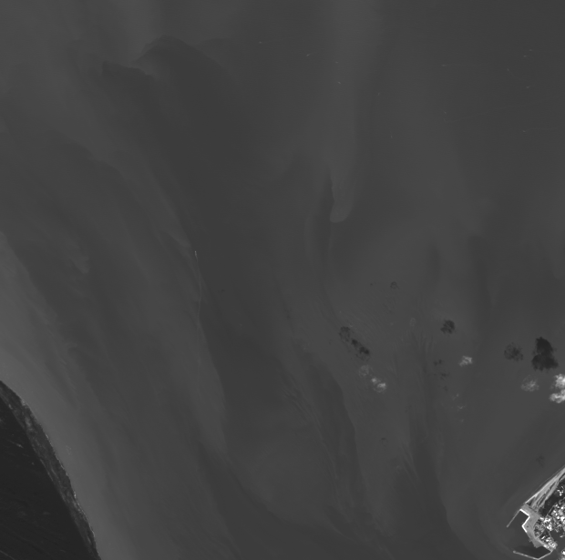
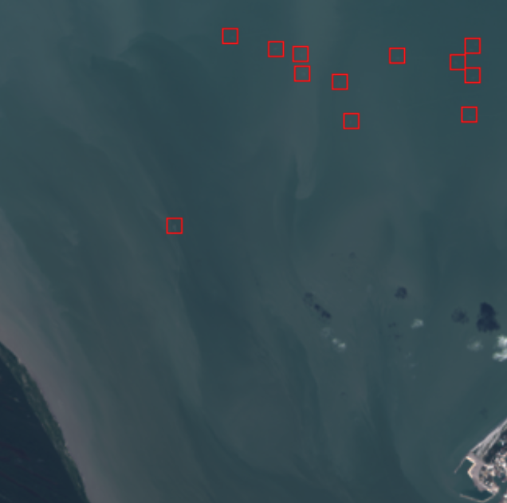

# Model Summary

## Overview
- **Model Name**: Landsat Vessel Detection
- **Tag**: `landsat_vessels_v1.0.0`
- **Last Updated**: `2026-09-09`

---

## Offline Evaluation Metrics

Note: The evaluation metrics are reported for the two-stage model (detector + classifier), without any filters.

| Date       | Version | Precision | Recall | F1-Score |
|------------|---------|-----------|--------|----------|
| 2024-11-15 | 0.0.1   | 0.72      | 0.53   | 0.61     |
| YYYY-MM-DD | TBD     | TBD       | TBD    | TBD      |

## Model Configurations
- **Detector**: `rslearn_projects/data/landsat_vessels/config_detector.yaml` (score_threshold 0.7)
- **Classifier**: `rslearn_projects/data/landsat_vessels/config_classifier_20260908d.yaml` (OlmoEarth-base, positive_class_threshold 0.99)
- **Filters**: marine infrastructure `rslearn_projects/rslp/utils/filter.py`

The deployed operating point is detector 0.7 / classifier 0.99: the lower detector threshold surfaces confident vessels in the 0.7-0.9 band, and the high classifier threshold acts as a sharp false-positive filter (Run d's probabilities cluster near 0/1).

---

## Round 1 Annotations

The `v1.0.0` classifier adds a round-1 re-annotation pass focused on hard negatives: ~2,000 labelled crops (~1,600 hard negatives / ~360 positives) drawn from the detector's own output on T1/T2 scenes sampled across the Skylight marine-regions ROI, spanning ~2.5 years (Jan 2024 – May 2026), with one scene per WRS-2 path/row to prevent split leakage. See `rslp/landsat_vessels/annotations/README.md` for the full process.

---

## Known Issues & Next Steps

1. **Missed Small Vessels**: The recall is not high because the model missed a lot of very small vessels.

Below is an example of the missed vessels, a lot of them are only visible in the B8 band (with 15m resolution) and are not visible in the RGB image (with 30m resolution):

    
    

*Possible solutions: (1) Add positive samples from the detector training set into the classifier training set.*

2. **False Positive**: Though the model now is more robust to false positives, it still sometimes misclassifies objects like whitecaps, islands as vessels.

*Possible solutions: (1) Add more negative samples into the classifier training set. (2) Add high-resolution distance-to-coastline filter to remove detections that are too close to the coastline.*

---

## Changelog
- **`v0.0.1`**: Initial model release. Offline evaluation metrics reported.
- **`v0.0.2`**: Improved pansharpening, added error message to LandsatResponse.
- **`v0.0.3`**: Increase crop size.
- **`v0.0.4`**: Add Prometheus timers.
- **`v0.0.5`**: Fix for new version of rslearn.
- **`v0.0.6`**: Fix bug with RGB crops.
- **`v0.0.7`**: Fix Docker container bug.
- **`v0.0.8`**: enable Pytorch Lightning environment variable parsing to allow disabling progress bar via environment variable.
- **`v1.0.0`**: replace the Swin classifier with an OlmoEarth-base classifier (Run d, `config_classifier_20260908d.yaml`, crop 32 / patch 2) trained with round-1 annotations; deploy at detector 0.7 / classifier 0.99.
