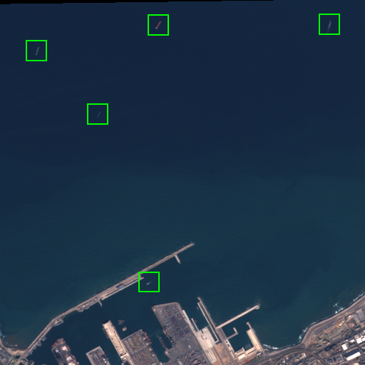

Sentinel-2 Vessel Detection
---------------------------

The Sentinel-2 vessel detection model detects ships in Sentinel-2 L1C scenes. We use
L1C instead of L2A since L1C scenes are released with a lower latency, and latency is
important for [Skylight](https://www.skylight.global/) (which is the primary use of
this model within Ai2).

It is trained on a dataset consisting of 43,443 image patches (ranging from 300x300 to
1000x1000) with 37,145 ship labels. See [our paper](https://arxiv.org/pdf/2312.03207)
for more details about the model and dataset.




Inference
---------

First, download the model checkpoint to the `RSLP_PREFIX` directory.

    cd rslearn_projects
    mkdir -p project_data/projects/sentinel2_vessels/data_20240927_satlaspretrain_patch512_00/checkpoints/
    wget https://storage.googleapis.com/ai2-rslearn-projects-data/sentinel2_vessels/best.ckpt -O project_data/projects/sentinel2_vessels/data_20240927_satlaspretrain_patch512_00/checkpoints/best.ckpt

The easiest way to apply the model is using the prediction pipeline in
`rslp/sentinel2_vessels/predict_pipeline.py`. It accepts a Sentinel-2 scene ID and
automatically downloads the scene images from a
[public Google Cloud Storage bucket](https://cloud.google.com/storage/docs/public-datasets/sentinel-2).

    mkdir output_crops
    mkdir scratch_dir
    python -m rslp.main sentinel2_vessels predict '[{"scene_id": "S2A_MSIL1C_20180904T110621_N0206_R137_T30UYD_20180904T133425", "geojson_path": "out.geojson", "crop_path": "output_crops/"}]' scratch_dir/
    qgis out.geojson scratch_dir/windows/default/default/layers/sentinel2/R_G_B/geotiff.tif

Then, `out.geojson` will contain a GeoJSON of detected ships while `output_crops` will
contain corresponding crops centered around those ships (showing the RGB B4/B3/B2
bands).


Training
--------

First, download the training dataset:

    cd rslearn_projects
    mkdir -p project_data/datasets/sentinel2_vessels/
    wget https://storage.googleapis.com/ai2-rslearn-projects-data/sentinel2_vessels/sentinel2_vessels.tar -O project_data/datasets/sentinel2_vessels.tar
    tar xvf project_data/datasets/sentinel2_vessels.tar --directory project_data/datasets/sentinel2_vessels/

It is an rslearn dataset consisting of window folders like
`windows/sargassum_train/1186117_1897173_158907/`. Inside each window folder:

- `layers/sentinel2/` contains different Sentinel-2 bands used by the model, such as
  `layers/sentinel2/R_G_B/image.png`.
- `layers/label/data.geojson` contains the positions of ships. These are offset from
  the bounds of the window which are in `metadata.json`, so subtract the window's
  bounds to get pixel coordinates relative to the image.

Use the command below to train the model. Note that Weights & Biases is needed. You can
disable W&B with `--no_log true` but then it may be difficult to track the metrics.

    python -m rslp.rslearn_main model fit --config data/sentinel2_vessels/config.yaml --data.init_args.path project_data/datasets/sentinel2_vessels/

To visualize outputs on the validation set:

    mkdir vis
    python -m rslp.rslearn_main model test --config data/sentinel2_vessels/config.yaml --data.init_args.path project_data/datasets/sentinel2_vessels/ --model.init_args.visualize_dir vis/ --load_best true


Model Version History
---------------------

The version names correspond to the `rslp_experiment` field in the model configuration
file (`data/sentinel2_vessels/config.yaml`).

- `data_20240927_satlaspretrain_patch512_00`: initial model.
- `data_20240213_00`: Some of the windows contained blank images. I re-ingested the
  dataset and the issue seems to be fixed. The model is re-trained.


Model Performance
-----------------

TODO


Docker Container with FastAPI
-----------------------------

We also have a Docker container that exposes a FastAPI interface to apply vessel
detection on Sentinel-2 scenes. This section explains how to setup the API.

### Run the Docker container

The Docker container does not contain the model weights. Instead, it expects the model
weights to be present in a directory based on the `RSLP_PREFIX` environment variable.
So download the model checkpoint:

    mkdir -p project_data/projects/sentinel2_vessels/data_20240927_satlaspretrain_patch512_00/checkpoints/
    wget https://storage.googleapis.com/ai2-rslearn-projects-data/projects/sentinel2_vessels/data_20240927_satlaspretrain_patch512_00/checkpoints/best.ckpt -O project_data/projects/sentinel2_vessels/data_20240927_satlaspretrain_patch512_00/checkpoints/best.ckpt

Run the container:

```bash
export SENTINEL2_PORT=5555
docker run \
    --rm -p $SENTINEL2_PORT:$SENTINEL2_PORT \
    -e RSLP_PREFIX=/project_data \
    -e SENTINEL2_PORT=$SENTINEL2_PORT \
    -v project_data/ /project_data/ \
    --shm-size=15g \
    --gpus all \
    ghcr.io/allenai/sentinel2-vessel-detection:v0.0.1
```

### Auto Documentation

This API has enabled Swagger UI (`http://<your_address>:<port_number>/docs`) and ReDoc (`http://<your_address>:<port_number>/redoc`).

### Making Requests

Process a scene by its Sentinel-2 scene ID. Note that the crop path is optional.

```bash
curl -X POST http://localhost:${SENTINEL2_PORT}/detections -H "Content-Type: application/json" -d '{"scene_id": "S2A_MSIL1C_20180904T110621_N0206_R137_T30UYD_20180904T133425", "crop_path": "crops/"}'
```

The API will respond with the vessel detection results in JSON format.

Alternatively, process the scene by providing the paths to the image assets. Currently
only the TCI asset is needed (the bands must be named [R, G, B]). The paths can be URIs
but must be accessible from the Docker container.

```bash
curl -X POST http://localhost:${SENTINEL2_PORT}/detections -H "Content-Type: application/json" -d '{"image_files": [{"bands": ["R", "G", "B"], "fname": "gs://gcp-public-data-sentinel-2/tiles/30/U/YD/S2A_MSIL1C_20180904T110621_N0206_R137_T30UYD_20180904T133425.SAFE/GRANULE/L1C_T30UYD_A016722_20180904T110820/IMG_DATA/T30UYD_20180904T110621_TCI.jp2"}]}'
```

### Docker Container Version History

- v0.0.1: initial version. It uses model `data_20240213_00`.
