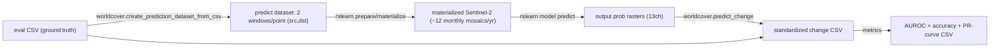
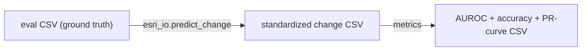

# Change Finder V2: Evaluation

Point-based evaluation of change-detection models (the LCC model and the WorldCover
land-cover model). The flow samples candidate points from evaluation tiles, annotates
them with the v2 annotation app, exports a ground-truth CSV, runs a model on windows
per point, turns predictions into a standardized per-point change CSV, and computes
metrics from that CSV.

```mermaid
flowchart LR
  tiles["tiles.csv"] -->|sample_tile_points| cand["candidate v2 JSON"]
  cand -->|annotation_app| ann["annotated v2 JSON"]
  ann -->|export_annotations_to_csv| gt["eval CSV (ground truth)"]
  gt -->|create_prediction_dataset_from_csv| ds["predict dataset (windows)"]
  ds -->|"rslearn prepare/materialize"| ds2["materialized imagery"]
  ds2 -->|"rslearn model predict"| pred["output_change rasters"]
  pred -->|predict_change_lcc| std["standardized change CSV"]
  std -->|metrics| out["AUROC + accuracy (stdout) + PR-curve CSV"]
  gt --> std
```



The standardized change CSV (produced by `predict_change_lcc.py` for the LCC model or
`worldcover/predict_change.py` for the WorldCover model) has a shared schema, so the
single `metrics.py` script works on either model's output. Columns: `row_index, lon,
lat, src_year, dst_year, has_changed, src_category, dst_category, has_prediction,
predicted_changed, change_score, pred_src_category, pred_dst_category`.

All scripts are run as modules, e.g.
`python -m rslp.change_finder_v2.evaluation.<script>`.

## 1. Sample candidate points (`sample_tile_points.py`)

Samples random points from `evaluation/tiles.csv` (one row per WGS84 evaluation tile
with `west/south/east/north`, `year`, `compare_from_year`, `compare_to_year`) and
writes a shuffled v2 annotation JSON with one 128x128 window per point.

```bash
python -m rslp.change_finder_v2.evaluation.sample_tile_points \
    --tiles-csv rslp/change_finder_v2/evaluation/tiles.csv \
    --output tile_points_v2.json \
    --points-per-tile 50
```

Then annotate `tile_points_v2.json` with the annotation app (see the main
[change_finder_v2 README](../README.md#running-the-annotation-app)). Annotators mark
each point as a change (`positive_points`, with `pre_change` /
`first_date_change_noticeable` / `post_change` / `pre_category` / `post_category`) or
no-change (`negative_points`, lon/lat only).

## 2. Export ground-truth CSV (`export_annotations_to_csv.py`)

Converts the annotated v2 JSON(s) into one CSV row per point.

Columns: `lon, lat, src_year, dst_year, has_changed, src_category, dst_category`.

- Change (positive) points: `has_changed=True`, `src_year = year(pre_change) - 1`,
  `dst_year = year(post_change) + 1`, categories from `pre_category`/`post_category`.
  Positive points missing any required field are skipped (and counted).
- No-change (negative) points: `has_changed=False`, blank categories, and fixed
  `src_year`/`dst_year` (defaults 2019/2021, configurable).

Points are also dropped (and counted) when they fall outside the supported imagery
range (`src_year < --min-src-year` or `dst_year > --max-dst-year`, defaults 2017/2024 -
e.g. a src_year of 2016 or a dst_year of 2025), or, for positive points, when
`src_category == dst_category` (no real land-cover change).

```bash
python -m rslp.change_finder_v2.evaluation.export_annotations_to_csv \
    --v2-json-paths tile_points_v2.json \
    --output eval.csv \
    --negative-src-year 2019 --negative-dst-year 2021 \
    --min-src-year 2017 --max-dst-year 2024
```

## 3. Create the prediction dataset (`create_prediction_dataset_from_csv.py`)

Replaces the `rslearn dataset add_windows` step from the main README's prediction
flow. Creates one 128x128 prediction window per CSV row, each in the point's own UTM
zone (which `add_windows` cannot do in a single call). The window is centered on the
point and assigned `time_range = (T, T)` with `T = {dst_year}-01-01 - 60 days`.

The reference "as of" time is therefore the beginning of `dst_year`:
[config_predict.json](../../../data/change_finder_v2/lcc_model/config_predict.json)
derives `sentinel2_quarterly` from `[T-1800d, T]` and `sentinel2_frequent_0` from
`[T, T+60d]`, so the 60-day frequent block ends exactly at `{dst_year}-01-01`.

The script also copies `config_predict.json` into the dataset as `config.json`, so you
can immediately run the standard prepare/materialize/predict steps:

```bash
EVAL_DS=/path/to/lcc_eval_ds/
python -m rslp.change_finder_v2.evaluation.create_prediction_dataset_from_csv \
    --csv eval.csv --ds-path "$EVAL_DS"

rslearn dataset prepare     --root "$EVAL_DS" --workers 32
rslearn dataset materialize --root "$EVAL_DS" --workers 128
rslearn model predict \
    --config data/change_finder_v2/lcc_model/config_predict.yaml \
    --data.init_args.path="$EVAL_DS"
```

Imagery uses the OlmoEarth Datasets source, so the API env vars must be set (see the
main README's Prerequisites).

## 4. Produce the LCC change CSV (`predict_change_lcc.py`)

Reads each prediction window's `output_change` raster, samples the prediction at the
annotated point's pixel, and writes the standardized change CSV (no metrics).

- `change_score = binary_change / 255` (the model's binary change probability, in
  `[0, 1]`, higher = more change).
- `predicted_changed = argmax(binary) == change`.
- `pred_src_category` / `pred_dst_category` are the argmax land-cover classes
  (nodata excluded).

```bash
python -m rslp.change_finder_v2.evaluation.predict_change_lcc \
    --csv eval.csv --ds-path "$EVAL_DS" --output eval_lcc.csv
```

Windows with no `output_change` raster (e.g. missing imagery) get `has_prediction=False`
and are reported in the summary.

## 5. Compute metrics (`metrics.py`)

Takes any method's standardized change CSV (LCC or WorldCover) and reports metrics over
the rows with `has_prediction=True`:

- AUROC (`change_score` vs `has_changed`),
- binary change accuracy / precision / recall (from `predicted_changed`),
- src/dst category accuracy over points "changed" in both GT and prediction,
- a precision/recall/F1 curve swept at thresholds `0.0, 0.05, ..., 1.0`
  (`--threshold-step`, default 0.05).

AUROC and accuracy print to stdout; the PR curve is written to `--output`
(columns `threshold, precision, recall, f1, tp, fp, fn, tn`).

```bash
python -m rslp.change_finder_v2.evaluation.metrics \
    --csv eval_lcc.csv --output eval_lcc_pr_curve.csv
```

---

## WorldCover model evaluation

The `worldcover/` subpackage evaluates the WorldCover land-cover **segmentation**
model (`data/land_cover_change/worldcover_change/config.yaml`) as a change detector.
That model predicts a single 13-class land-cover map, so we run it twice per eval
point (on `src_year` and `dst_year` imagery) and derive change from the two land-cover
probability distributions. It reuses the same eval CSV produced by
`export_annotations_to_csv.py`.



Imagery uses the OlmoEarth Datasets source, so the API env vars must be set (see the
main [change_finder_v2 README](../README.md#prerequisites)):

```bash
export OEDATASETS_API_URL=https://datasets.olmoearth.allenai.org
export DATASETS_API_TOKEN=<your-token>
```

### 1. Create the prediction dataset

Creates two 64x64 windows per CSV row (`eval_{i:06d}_src` / `eval_{i:06d}_dst`), each
in the point's own UTM zone with a full-calendar-year `time_range`
(`[{year}-01-01, {year}-12-31]`, mirroring the WorldCover training windows). Copies
`config_predict.json` (OlmoEarth Datasets `sentinel2` + a 13-band float32 `output`
layer) into the dataset as `config.json`.

```bash
EVAL_DS=/path/to/worldcover_eval_ds/
python -m rslp.change_finder_v2.evaluation.worldcover.create_prediction_dataset_from_csv \
    --csv eval.csv --ds-path "$EVAL_DS"

rslearn dataset prepare     --root "$EVAL_DS" --workers 32
rslearn dataset materialize --root "$EVAL_DS" --workers 128
```

### 2. Run prediction

Reuses the training `config.yaml`; the added `predict_config` (group `predict`,
`skip_targets`), `output_probs: true`, and `RslearnWriter` are prediction-only and do
not affect training. Override the dataset path to point at the eval dataset:

```bash
rslearn model predict \
    --config data/land_cover_change/worldcover_change/config.yaml \
    --data.init_args.path="$EVAL_DS"
```

This writes a 13-channel land-cover probability raster to each window's `output` layer.

### 3. Derive change scores (`worldcover/predict_change.py`)

Reads the `output` raster at the annotated point's pixel for the `_src` and `_dst`
windows, gets the two 13-class probability distributions `p_src` / `p_dst`, and writes
one standardized CSV row per point (nodata at index 0 excluded for argmax/category):

- `pred_src_category` / `pred_dst_category` = argmax land-cover class of `p_src` /
  `p_dst`.
- `predicted_changed` = `argmax(p_src) != argmax(p_dst)`.
- `change_score` (the `--method`, default `src_class_prob_drop`) =
  `max(p_src) - p_dst[argmax(p_src)]`, the drop in the src-year top class's probability
  from src to dst year. This is in `[0, 1]`; **higher means more change**, so a metric
  script can use it directly for AUROC.

```bash
python -m rslp.change_finder_v2.evaluation.worldcover.predict_change \
    --csv eval.csv --ds-path "$EVAL_DS" --output eval_worldcover.csv
```

This writes the shared standardized change CSV (same columns as the LCC flow). Points
missing the `_src` and/or `_dst` raster are reported and have `has_prediction=False`.

### 4. Compute metrics (`metrics.py`)

The same metric script as the LCC flow (step 5 above) consumes the WorldCover CSV:

```bash
python -m rslp.change_finder_v2.evaluation.metrics \
    --csv eval_worldcover.csv --output eval_worldcover_pr_curve.csv
```

---

## Embeddings model evaluation

The `embeddings/` subpackage evaluates pretrained embeddings as change detectors:
- **AlphaEarth** = Google Satellite Embedding V1 (`GoogleSatelliteEmbeddingV1`, AWS Open
  Data, public, no creds): an annual 64-band embedding at 10 m/px, years 2018-2024. It is
  just a data-source layer (prepare/materialize, no model).
- **OlmoEarth-v1-Base**: a 768-band `embeddings` layer computed via `rslearn model
  predict` (per `rslearn` `docs/examples/OlmoEarthEmbeddings.md`), Sentinel-2 only via the
  OlmoEarth Datasets source (set `OEDATASETS_API_URL` / `DATASETS_API_TOKEN`).

Neither source classifies land cover, so change is scored from the per-point embedding at
`src_year` vs `dst_year`, in two modes:
- `cosine` (unsupervised): `change_score = 1 - cosine_similarity(e_src, e_dst)`.
- `linear_probe` (supervised): a logistic-regression probe fit on labeled training points,
  `change_score = predicted P(change)`. The feature is selectable via `--feature-mode`:
  `absdiff` (default, `|e_src - e_dst|`) or `concat` (`[e_src, e_dst]`).

Both write the shared standardized CSV (the `src_category`/`dst_category`/`predicted_changed`
columns stay blank for cosine, since embeddings give no class).

### 1. Create the embeddings dataset

Creates two windows per point (`*_src` / `*_dst`, point UTM zone, full-calendar-year
`time_range`). The eval CSV goes to group `predict` (`eval_{i:06d}_*`). For the linear
probe, also pass a training CSV (group `train`, `train_{i:06d}_*`) produced by running
`export_annotations_to_csv.py` on the training v2 annotation JSONs (the same ones that
feed `lcc_model.prepare`):

```bash
python -m rslp.change_finder_v2.evaluation.export_annotations_to_csv \
    --v2-json-paths train_annotations.json --output train.csv

EMBED_DS=/path/to/embeddings_eval_ds/
python -m rslp.change_finder_v2.evaluation.embeddings.create_prediction_dataset_from_csv \
    --source alphaearth --csv eval.csv --train-csv train.csv --ds-path "$EMBED_DS"
```

Use `--source olmoearth` for the OlmoEarth flow instead.

### 2. Materialize / compute embeddings

AlphaEarth (the `embeddings` layer is a data source):

```bash
rslearn dataset prepare     --root "$EMBED_DS" --workers 32
rslearn dataset materialize --root "$EMBED_DS" --workers 128
```

OlmoEarth (materialize Sentinel-2, then run the embedding model over both groups):

```bash
rslearn dataset prepare     --root "$EMBED_DS" --workers 32
rslearn dataset materialize --root "$EMBED_DS" --workers 128
EMBED_DS="$EMBED_DS" rslearn model predict --config data/change_finder_v2/evaluation/embeddings/olmoearth_model.yaml
```

The model config's `predict_config.groups` is `["predict", "train"]`, so a single predict
run embeds both the eval and (if present) training windows.

### 3. Score change

Cosine (unsupervised):

```bash
python -m rslp.change_finder_v2.evaluation.embeddings.predict_change \
    --csv eval.csv --ds-path "$EMBED_DS" --output eval_alphaearth_cosine.csv
```

Linear probe (supervised; fits on `train`, scores `predict`):

```bash
python -m rslp.change_finder_v2.evaluation.embeddings.linear_probe \
    --csv eval.csv --train-csv train.csv --ds-path "$EMBED_DS" \
    --feature-mode absdiff --output eval_alphaearth_probe.csv
```

`--feature-mode` is `absdiff` (default, `|e_src - e_dst|`) or `concat` (`[e_src, e_dst]`).

Both write the shared standardized change CSV, which the metric script
(`rslp.change_finder_v2.evaluation.metrics`) consumes directly. Points whose `src_year` or
`dst_year` lack an embedding (e.g. AlphaEarth outside 2018-2024, or missing imagery) are
reported and have `has_prediction=False`; for the linear probe such points are also
dropped from the training fit.

---

## ESRI/IO baseline

The `esri_io/` subpackage is a baseline that scores change directly from the **ESRI 10 m
Annual Land Cover** map (by Impact Observatory) — it does **not** run a model and does not
build an rslearn dataset. The maps are pre-downloaded as one GeoTIFF per MGRS grid zone
(e.g. `01C_lc_stack.tif`) under
`/weka/dfive-default/rslearn-eai/datasets/esri_lc_stacks/`, each in its own UTM CRS with
one `uint8` band per year (2017-2024). Because that path is on WEKA, run this on the
cluster / a Beaker session.



`predict_change.py` builds a spatial index over the tiles (each tile's WGS84 bounding box,
cached to `--index-path`), then for each eval point considers every tile whose bbox contains
it (grid zones overlap) and uses the first where both the `src_year` and `dst_year` classes
are valid (not nodata / clouds). Per point:

- `pred_src_category` / `pred_dst_category`: the ESRI class for src / dst year, mapped to the
  annotation category vocabulary (`1→water, 2→tree, 4→wetland (herbaceous), 5→crops,
  7→urban/built-up, 8→bare, 9→snow and ice, 11→grassland`). ESRI has no burnt / fallow /
  Lichen and moss / shrub classes, so those category comparisons won't match.
- `predicted_changed`: `class_src != class_dst`.
- `change_score` (binary, in {0.0, 1.0}): `1.0` if the class changed else `0.0`. ESRI gives a
  hard class label (no probability), so this is a hard-decision baseline and the PR curve is
  effectively a single operating point.

```bash
python -m rslp.change_finder_v2.evaluation.esri_io.predict_change \
    --csv eval.csv \
    --data-dir /weka/dfive-default/rslearn-eai/datasets/esri_lc_stacks \
    --index-path esri_tile_index.json \
    --output eval_esri_io.csv

python -m rslp.change_finder_v2.evaluation.metrics \
    --csv eval_esri_io.csv --output eval_esri_io_pr_curve.csv
```

Points with no covering tile, an out-of-range year, or nodata/clouds at the point are
reported and have `has_prediction=False`.
