# Change Finder V2: Evaluation

Point-based evaluation of the LCC (land cover change) model. The flow samples
candidate points from evaluation tiles, annotates them with the v2 annotation app,
exports a ground-truth CSV, runs the model on one window per point, and correlates
the predictions against the CSV.

```mermaid
flowchart LR
  tiles["tiles.csv"] -->|sample_tile_points| cand["candidate v2 JSON"]
  cand -->|annotation_app| ann["annotated v2 JSON"]
  ann -->|export_annotations_to_csv| gt["eval CSV (ground truth)"]
  gt -->|create_prediction_dataset_from_csv| ds["predict dataset (windows)"]
  ds -->|"rslearn prepare/materialize"| ds2["materialized imagery"]
  ds2 -->|"rslearn model predict"| pred["output_change rasters"]
  pred -->|correlate_predictions| metrics["merged CSV + metrics"]
  gt --> metrics
```



All scripts are run as modules, e.g.
`python -m rslp.change_finder_v2.evaluation.<script>`.

## 1. Sample candidate points (`sample_tile_points.py`)

Samples random points from `evaluation/tiles.csv` (one row per WGS84 evaluation tile
with `west/south/east/north`, `year`, `compare_from_year`, `compare_to_year`) and
writes a shuffled v2 annotation JSON with one 128x128 window per point.

```bash
python -m rslp.change_finder_v2.evaluation.sample_tile_points \
    --tiles-csv rslp/change_finder_v2/evaluation/tiles.csv \
    --output tile_points_v2.json \
    --points-per-tile 50
```

Then annotate `tile_points_v2.json` with the annotation app (see the main
[change_finder_v2 README](../README.md#running-the-annotation-app)). Annotators mark
each point as a change (`positive_points`, with `pre_change` /
`first_date_change_noticeable` / `post_change` / `pre_category` / `post_category`) or
no-change (`negative_points`, lon/lat only).

## 2. Export ground-truth CSV (`export_annotations_to_csv.py`)

Converts the annotated v2 JSON(s) into one CSV row per point.

Columns: `lon, lat, src_year, dst_year, has_changed, src_category, dst_category`.

- Change (positive) points: `has_changed=True`, `src_year = year(pre_change) - 1`,
  `dst_year = year(post_change) + 1`, categories from `pre_category`/`post_category`.
  Positive points missing any required field are skipped (and counted).
- No-change (negative) points: `has_changed=False`, blank categories, and fixed
  `src_year`/`dst_year` (defaults 2019/2021, configurable).

```bash
python -m rslp.change_finder_v2.evaluation.export_annotations_to_csv \
    --v2-json-paths tile_points_v2.json \
    --output eval.csv \
    --negative-src-year 2019 --negative-dst-year 2021
```

## 3. Create the prediction dataset (`create_prediction_dataset_from_csv.py`)

Replaces the `rslearn dataset add_windows` step from the main README's prediction
flow. Creates one 128x128 prediction window per CSV row, each in the point's own UTM
zone (which `add_windows` cannot do in a single call). The window is centered on the
point and assigned `time_range = (T, T)` with `T = {dst_year}-01-01 - 60 days`.

The reference "as of" time is therefore the beginning of `dst_year`:
[config_predict.json](../../../data/change_finder_v2/lcc_model/config_predict.json)
derives `sentinel2_quarterly` from `[T-1800d, T]` and `sentinel2_frequent_0` from
`[T, T+60d]`, so the 60-day frequent block ends exactly at `{dst_year}-01-01`.

The script also copies `config_predict.json` into the dataset as `config.json`, so you
can immediately run the standard prepare/materialize/predict steps:

```bash
EVAL_DS=/path/to/lcc_eval_ds/
python -m rslp.change_finder_v2.evaluation.create_prediction_dataset_from_csv \
    --csv eval.csv --ds-path "$EVAL_DS"

rslearn dataset prepare     --root "$EVAL_DS" --workers 32
rslearn dataset materialize --root "$EVAL_DS" --workers 128
rslearn model predict \
    --config data/change_finder_v2/lcc_model/config_predict.yaml \
    --data.init_args.path="$EVAL_DS"
```

Imagery uses the OlmoEarth Datasets source, so the API env vars must be set (see the
main README's Prerequisites).

## 4. Correlate predictions with ground truth (`correlate_predictions.py`)

Reads each prediction window's `output_change` raster, samples the prediction at the
annotated point's pixel, and joins it with the CSV.

- `predicted_changed = argmax(binary) == change`; also emits the raw `change_prob`
  (`binary_change / 255`) so you can sweep thresholds.
- `pred_src_category` / `pred_dst_category` are the argmax land-cover classes
  (nodata excluded).

```bash
python -m rslp.change_finder_v2.evaluation.correlate_predictions \
    --csv eval.csv --ds-path "$EVAL_DS" --output eval_merged.csv
```

Writes `eval_merged.csv` (ground truth + predicted columns + `change_prob` +
`has_prediction`) and prints:
- binary change accuracy / precision / recall (positive = changed),
- a binary change precision/recall/F1 curve, sweeping `change_prob` thresholds
  `[0.5, 0.6, 0.7, 0.8, 0.9, 0.95]`,
- src/dst category accuracy over points that are "changed" in both GT and prediction.

Windows with no `output_change` raster (e.g. missing imagery) are reported and
excluded from the metrics.
