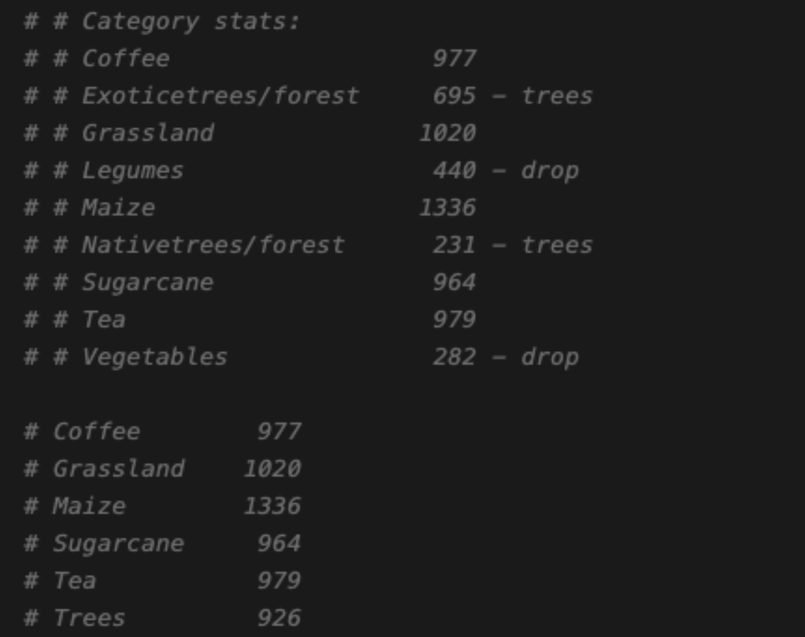

# Kenya/Nandi County Crop Type Classification

The original dataset contains 819 polygons, which has been converted into about 19K points (at 10m resolution). The converted points include point_id, polygon_id, latitude (y), longitude (x), category, and other metadata (like planting date, harvest date).

- Polygons: `/weka/dfive-default/yawenz/datasets/CGIAR/NandiGroundTruth`
- Points: `/weka/dfive-default/yawenz/datasets/CGIAR/NandiGroundTruthPoints.csv`

The original categories didn’t include water or built-up areas. To support Land Use and Land Cover (LULC) mapping, we added randomly sampled points from [WorldCover](https://viewer.esa-worldcover.org/worldcover/) for "Water" (Value: 50 in WorldCover) and "Built-up" (Value: 80 in WorldCover) classes.

- Kenya/Nandi county shapefile: `/weka/dfive-default/yawenz/datasets/CGIAR/Nandi_County`
- ESA WorldCover images for Nandi county: `/weka/dfive-default/yawenz/datasets/CGIAR/WorldCover/NandiCounty_worldcover.tif`

### Step 1. Create Windows

Run the command to create windows for the groundtruth points:
```
python rslp/crop/kenya_nandi/create_windows_for_groundtruth.py --csv_path=/weka/dfive-default/yawenz/datasets/CGIAR/NandiGroundTruthPoints.csv --ds_path=/weka/dfive-default/rslearn-eai/datasets/crop/kenya_nandi/20250625 --window_size=32
```

By default, we sample at most 10 pixels per polygon, to avoid the case where one polygon creates many homogeneous points with the same category. Also, following the CGIAR/IFPRI workflow (more details can be found [here](https://www.ifpri.org/blog/from-space-to-soil-advancing-crop-mapping-and-ecosystem-insights-for-smallholder-agriculture-in-kenya/)), we can optionally apply postprocessing on the original categories, by merging the "Exoticetrees/forests" and "Nativetrees/forest" into "Trees", and dropping the categories with less labels, mainly "Legumes" and "Vegatables". By default, we split train/val by polygons, and perform category postprocessing.




Run the command to create windows for the worldcover points (we sampled 1K points for Water and Built-up separately):
```
python rslp/crop/kenya_nandi/create_windows_for_worldcover.py --csv_path=/weka/dfive-default/yawenz/datasets/CGIAR/NandiWorldCoverPoints_sampled.csv --ds_path=/weka/dfive-default/rslearn-eai/datasets/crop/kenya_nandi/20250625 --window_size=32
```

- rslearn dataset: `/weka/dfive-default/rslearn-eai/datasets/crop/kenya_nandi/20250625`
- GroundTruth group: `groundtruth_random_split_window_32`
- WorldCover group: `worldcover_window_32`

TODO(yawenz): add grid split, ensure that nearby polygons are not in the same split.

### Step 2. Prepare/Materialize Windows

Run the command to prepare and materialize groundtruth windows:
```
export DATASET_PATH=/weka/dfive-default/rslearn-eai/datasets/crop/kenya_nandi/20250625
export DATASET_GROUP=groundtruth_polygon_split_window_32
rslearn dataset prepare --root DATASET_PATH --group DATASET_GROUP --workers 64 --no-use-initial-job --retry-max-attempts 8 --retry-backoff-seconds 60
rslearn dataset materialize --root DATASET_PATH --group DATASET_GROUP --workers 64 --no-use-initial-job --retry-max-attempts 8 --retry-backoff-seconds 60
```

Run the command to prepare and materialize worldcover windows:
```
export DATASET_PATH=/weka/dfive-default/rslearn-eai/datasets/crop/kenya_nandi/20250625
export DATASET_GROUP=worldcover_window_32
rslearn dataset prepare --root DATASET_PATH --group DATASET_GROUP --workers 64 --no-use-initial-job --retry-max-attempts 8 --retry-backoff-seconds 60
rslearn dataset materialize --root DATASET_PATH --group DATASET_GROUP --workers 64 --no-use-initial-job --retry-max-attempts 8 --retry-backoff-seconds 60
```

### Step 3. Finetune Helios

Run the following commands to finetune Helios for crop type classification:

- Experiment 1: single modality (Sentinel2) + time-series (12 months), window_size = 4, patch_size = 4
```
python -m rslp.main helios launch_finetune --helios_checkpoint_path /weka/dfive-default/helios/checkpoints/favyen/v0.2_base_latent_mim_128_alldata_random_fixed_modality_0.5/step320000 --patch_size 4 --encoder_embedding_size 768 --image_name favyen/rslphelios3 --config_paths+=data/helios/v2_nandi_crop_type/finetune_s2.yaml --cluster+=ai2/saturn-cirrascale --rslp_project 2025_06_26_helios_finetuning --experiment_id v2_crop_type_classification_helios_base_S2_ts_ws4_ps4
```

- Experiment 2: multimodal (Sentinel2 + Sentinel1) + time-series (12 months), window_size = 8, patch_size = 1
```
python -m rslp.main helios launch_finetune --helios_checkpoint_path /weka/dfive-default/helios/checkpoints/favyen/v0.2_base_latent_mim_128_alldata_random_fixed_modality_0.5/step320000 --patch_size 1 --encoder_embedding_size 768 --image_name favyen/rslphelios3 --config_paths+=data/helios/v2_nandi_crop_type/finetune_s1_s2.yaml --cluster+=ai2/saturn-cirrascale --rslp_project 2025_06_26_helios_finetuning --experiment_id v2_crop_type_classification_helios_base_S1_S2_ts_ws8_ps1
```

### Step 4. Make Predictions

We first create 128x128 windows for the whole Nandi county, then use the finetuned model to perform predictions on those windows.

```
export DATASET_PATH=/weka/dfive-default/rslearn-eai/datasets/crop/kenya_nandi/20250616
rslearn dataset add_windows --root $DATASET_PATH --group nandi_county --utm --resolution 10 --grid_size 128 --src_crs EPSG:4326 --box=34.6999,-0.114,35.4549,0.5672 --start 2023-03-01T00:00:00+00:00 --end 2023-03-31T00:00:00+00:00 --name nandi
```

Prediction (note that the minimum window size is 4 if we set `zoom_offset` for Sentinel2 bands)
```
python -m rslp.main helios launch_finetune --helios_checkpoint_path /weka/dfive-default/helios/checkpoints/favyen/v0.2_base_latent_mim_128_alldata_random_fixed_modality_0.5/step320000 --patch_size 4 --encoder_embedding_size 768 --image_name favyen/rslphelios7 --config_paths+=data/helios/v2_nandi_crop_type/finetune_s2.yaml --cluster+=ai2/saturn-cirrascale --rslp_project 2025_06_26_helios_finetuning --experiment_id v2_crop_type_classification_helios_base_S2_ts_ws4_ps4 --mode predict
```

2025-08-15

Add back `Vegetables` and `Legumes` classes so that more classes are being covered. In total, 19K points.

| Category   |   Count |
|:-----------|--------:|
| Sugarcane  |    3870 |
| Maize      |    3126 |
| Tea        |    2906 |
| Grassland  |    2724 |
| Forest     |    2586 |
| Coffee     |    2533 |
| Legumes    |     977 |
| Vegetables |     325 |

A helpful function is to convert polygons to points, but still carry the original polygon id. 

Use beaker launcher to materialize the dataset: 
```
python -m rslp.main common launch_data_materialization_jobs --image favyen/rslp_image --ds_path DATASET_PATH --group DATASET_GROUP --clusters+=ai2/neptune-cirrascale --num_jobs 10
```

Create `label_raster` for both ground-truth and worldcover windows.

Launch Helios finetune:
```
python -m rslp.main helios launch_finetune --image_name favyen/rslphelios10 --config_paths+=data/helios/v2_nandi_crop_type/finetune_s2_20250815.yaml --cluster+=ai2/titan-cirrascale --rslp_project 2025_08_15_nandi_crop_type --experiment_id nandi_crop_type_segment_helios_base_S2_ts_ws4_ps2_bs8
```

Predictions:
```
python -m rslp.main helios launch_finetune --image_name favyen/rslphelios10 --config_paths+=data/helios/v2_nandi_crop_type/finetune_s2_20250815.yaml --cluster+=ai2/saturn-cirrascale --mode predict --gpus 8 --experiment_id nandi_crop_type_segment_helios_base_S2_ts_ws4_ps2_bs8_new_checkpoint_lower_lr --rslp_project 2025_08_15_nandi_crop_type
```
