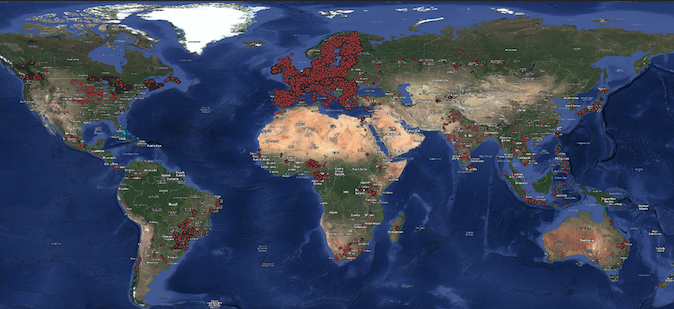

# WorldCereal Cropland Classification


### 1. Process WorldCereal Reference Data

Until 06/14/2025, there're in total 142 collections in the [WorldCereal Reference Data Collections](https://ewoc-rdm-ui.iiasa.ac.at/map). By filtering out by the scores of `confidenceLandCover` and `confidenceCropType` (at least 90, value range: 0-100), we downloaded 90 collections (globally, from 2017 to 2023). For the Point features, we kept their original latitude and longitude, and for Polygon features, we extracted their centroid latitude and longitude, which results in about 54M points (as shown in the figure blow). However, the dataset is heavily biased toward certain regions (e.g., Europe has a very high density of crop labels), so we filtered the data by sampling up to 100 points per [H3 cell](https://h3geo.org/) at resolution 3 (in total 1,378 cells, approximately 1,058 km² each cell), which results in about 66K points (cropland: 35,834, non-cropland: 30,166).



- WorldCereal collections metadata: `/weka/dfive-default/yawenz/datasets/WorldCereal/csv/worldcereal_collections.csv`
- WorldCereal collections geoparpuets: `/weka/dfive-default/yawenz/datasets/WorldCereal/geoparquets`
- WorldCereal points: `/weka/dfive-default/yawenz/datasets/WorldCereal/csv/worldcereal_points.csv`
- WorldCereal points after sampling up to 100 points per `h3_l3_cell`: `/weka/dfive-default/yawenz/datasets/WorldCereal/csv/worldcereal_points_filtered.csv`
- WorldCereal points for creating windows: `/weka/dfive-default/yawenz/datasets/WorldCereal/csv/worldcereal_points_filtered_level_123.csv`

Run the following commands to download and process WorldCereal data:
```
python rslp/crop/worldcereal/request_worldcereal.py
python rslp/crop/worldcereal/process_worldcereal.py
python rslp/crop/worldcereal/analyze_worldcereal.py
```

TODO (yawenz): move csv and geoparquets to rslearn-eai artifacts.

### 2. Create Windows

Run the following commands to create windows:
```
python rslp/crop/worldcereal/create_windows_for_cropland.py --csv_path /weka/dfive-default/yawenz/datasets/WorldCereal/csv/worldcereal_points_filtered_level_123.csv --ds_path /weka/dfive-default/rslearn-eai/datasets/crop/worldcereal_cropland/20250626 --window_size 32
```

### 3. Prepare/Materialize Windows

Run the command to prepare and materialize groundtruth windows:
```
rslearn dataset prepare --root /weka/dfive-default/rslearn-eai/datasets/crop/worldcereal_cropland/20250626 --group h3_sample100_66K --workers 64 --no-use-initial-job --retry-max-attempts 8 --retry-backoff-seconds 60

python rslp/scripts/beaker_launcher.py --project worldcereal_cropland --ds_path /weka/dfive-default/rslearn-eai/datasets/crop/worldcereal_cropland/20250626 --group h3_sample100_66K --image_name favyen/rslp --clusters ai2/saturn-cirrascale --num_jobs 10
```

### 3. Finetune Helios

```
python -m rslp.main helios launch_finetune --helios_checkpoint_path /weka/dfive-default/helios/checkpoints/joer/v0.1_base_latent_mim_space_time/step165000 --patch_size 8 --encoder_embedding_size 768 --image_name favyen/rslphelios2 --config_paths+=data/helios/v2_worldcereal_cropland/finetune_s1_s2.yaml --cluster+=ai2/ceres-cirrascale --cluster+=ai2/saturn-cirrascale --rslp_project 2025_06_17_helios_finetuning --experiment_id v2_cropland_classification_helios_S1_S2
```

Experiments:

- Model checkpoint
- Modality (S1 + S2, S2)
- Patch size: 1, 2, 4, 8
- Window size: 1, 4, 8, 16, 32
- Timesteps: 1, 12


```
python -m rslp.main helios launch_finetune --helios_checkpoint_path /weka/dfive-default/helios/checkpoints/joer/v0.1_base_latent_mim_space_time/step165000 --patch_size 1 --encoder_embedding_size 768 --image_name favyen/rslphelios2 --config_paths+=data/helios/v2_worldcereal_cropland/finetune_s2.yaml --cluster+=ai2/ceres-cirrascale --cluster+=ai2/saturn-cirrascale --rslp_project 2025_06_17_helios_finetuning --experiment_id v2_cropland_classification_helios_S2_only_ws1_ps1
```

New!

```
python -m rslp.main helios launch_finetune --helios_checkpoint_path /weka/dfive-default/helios/checkpoints/favyen/v0.2_base_latent_mim_128_alldata_random_fixed_modality_0.5/step320000 --patch_size 1 --encoder_embedding_size 768 --image_name favyen/rslphelios3 --config_paths+=data/helios/v2_worldcereal_cropland/finetune_s1_s2.yaml --cluster+=ai2/saturn-cirrascale --rslp_project 2025_06_26_helios_finetuning --experiment_id v2_cropland_classification_helios_base_S1_S2_ts_ws1_ps1
```

```
python -m rslp.main helios launch_finetune --helios_checkpoint_path /weka/dfive-default/helios/checkpoints/favyen/v0.2_base_latent_mim_128_alldata_random_fixed_modality_0.5/step320000 --patch_size 8 --encoder_embedding_size 768 --image_name favyen/rslphelios3 --config_paths+=data/helios/v2_worldcereal_cropland/finetune_s2.yaml --cluster+=ai2/saturn-cirrascale --rslp_project 2025_06_26_helios_finetuning --experiment_id v2_cropland_classification_helios_base_S2_ts_ws8_ps8
```
