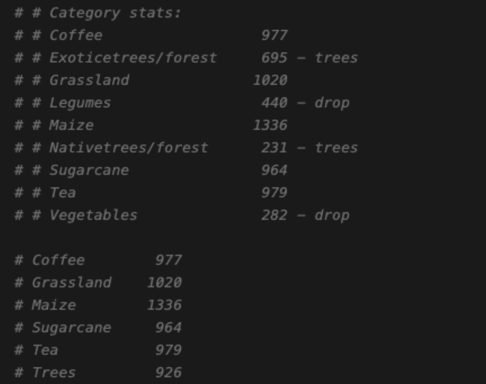

# Kenya/Nandi county crop type mapping

The original dataset contains 819 polygons, which has been converted into about 19K points (at 10m resolution). The converted points include point_id, polygon_id, latitude (y), longitude (x), category, and other metadata (like planting date, harvest date).

- Polygons: `gs://ai2-helios-us-central1/evaluations/crop_type_mapping/cgiar/NandiGroundTruth`
- Points: `gs://ai2-helios-us-central1/evaluations/crop_type_mapping/cgiar/NandiGroundTruthPoints.csv`

The original categories didn’t include water or built-up areas. To support Land Use and Land Cover (LULC) mapping, we added randomly sampled points from [WorldCover](https://viewer.esa-worldcover.org/worldcover/) for "Water" (Value: 50 in WorldCover) and "Built-up" (Value: 80 in WorldCover) classes.

- Kenya/Nandi county shapefile: `gs://ai2-helios-us-central1/evaluations/crop_type_mapping/cgiar/Nandi_County`
- ESA WorldCover images for Nandi county: `gs://ai2-helios-us-central1/evaluations/crop_type_mapping/cgiar/WorldCover/NandiCounty_worldcover.tif`

### Step 1. Create Windows

Run the command to create windows for the groundtruth points:
```
python rslp/crop_type_mapping/create_windows_for_groundtruth.py --csv_path=gs://ai2-helios-us-central1/evaluations/crop_type_mapping/cgiar/NandiGroundTruthPoints.csv --ds_path=/weka/dfive-default/rslearn-eai/datasets/crop_type_mapping/20250409_kenya_nandi --window_size=32
```

By default, we sample at most 10 pixels per polygon, to avoid the case where one polygon creates many homogeneous points with the same category. Also, following the CGIAR/IFPRI workflow (more details can be found [here](https://www.ifpri.org/blog/from-space-to-soil-advancing-crop-mapping-and-ecosystem-insights-for-smallholder-agriculture-in-kenya/)), we can optionally apply postprocessing on the original categories, by merging the "Exoticetrees/forests" and "Nativetrees/forest" into "Trees", and dropping the categories with less labels, mainly "Legumes" and "Vegatables". By default, we keep the original categories (9 classes in total).




Run the command to create windows for the worldcover points (we sampled 1K points for Water and Built-up separately):
```
python rslp/crop_type_mapping/create_windows_for_groundtruth.py --csv_path=gs://ai2-helios-us-central1/evaluations/crop_type_mapping/cgiar/NandiGroundTruthPoints.csv --ds_path=/weka/dfive-default/rslearn-eai/datasets/crop_type_mapping/20250409_kenya_nandi --window_size=32
```

- rslearn dataset: `/weka/dfive-default/rslearn-eai/datasets/crop_type_mapping/20250409_kenya_nandi`
- GroundTruth group: `groundtruth_random_split_window_32`
- WorldCover group: `worldcover_window_32`

### Step 2. Prepare/Materialize Windows

- Data Configuration: `/weka/dfive-default/rslearn-eai/datasets/crop_type_mapping/20250409_kenya_nandi/config.json`

For this task, we primarily use Sentinel-1 and Sentinel-2 L2A data, selecting the most recent 6 months (as defined by `max_matches` in the data configuration) from the 1-year data.

Run the command to prepare and materialize groundtruth windows:
```
rslearn dataset prepare --root /weka/dfive-default/rslearn-eai/datasets/crop_type_mapping/20250409_kenya_nandi --group groundtruth_random_split_window_32 --workers 64 --no-use-initial-job --retry-max-attempts 8 --retry-backoff-seconds 60

rslearn dataset materialize --root /weka/dfive-default/rslearn-eai/datasets/crop_type_mapping/20250409_kenya_nandi --group groundtruth_random_split_window_32 --workers 64 --no-use-initial-job --retry-max-attempts 8 --retry-backoff-seconds 60
```

Run the command to prepare and materialize worldcover windows:
```
rslearn dataset prepare --root /weka/dfive-default/rslearn-eai/datasets/crop_type_mapping/20250409_kenya_nandi --group worldcover_window_32 --workers 64 --no-use-initial-job --retry-max-attempts 8 --retry-backoff-seconds 60

rslearn dataset materialize --root /weka/dfive-default/rslearn-eai/datasets/crop_type_mapping/20250409_kenya_nandi --group worldcover_window_32 --workers 64 --no-use-initial-job --retry-max-attempts 8 --retry-backoff-seconds 60
```

### Step 3. Finetune Helios

- Helios Checkpoint: `/weka/dfive-default/helios/checkpoints/joer/v0.1_base_latent_mim_space_time/step165000`
- Model Configuration: `data/helios/v2_crop_type_mapping/finetune_s1_s2.yaml`

Run the command to start finetuning Helios for crop type classification.
